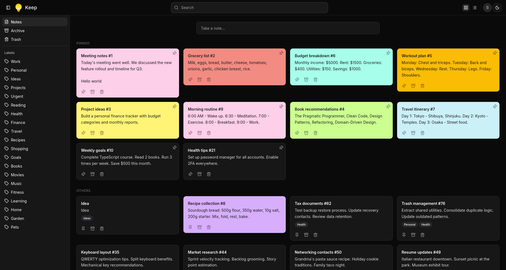
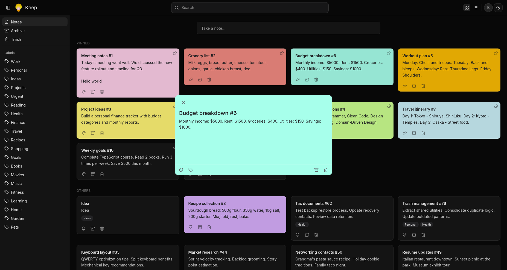
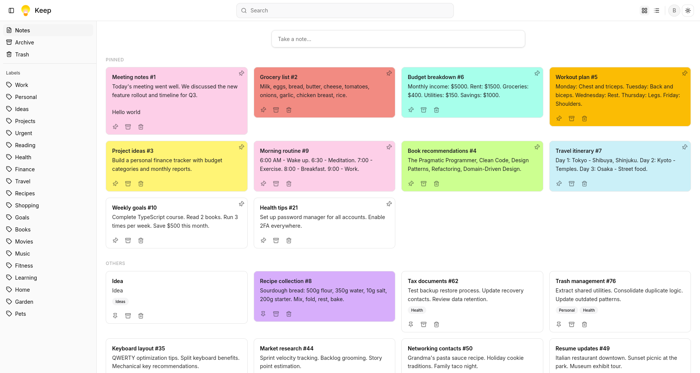

# Google Keep Clone

> A full-stack Google Keep clone with drag-and-drop, OAuth, image upload, and responsive UI — built with an AI-assisted workflow.



<!--  -->

<!--  -->

## Features

- **Notes CRUD** — create, edit, soft-delete, restore, permanent delete
- **Drag & drop reorder** — persistent sort order saved to PostgreSQL
- **Pin / archive / trash** — three-state lifecycle with restore
- **Labels** — many-to-many relationships, filter by label
- **Image upload** — S3-compatible storage with server-side validation
- **Auth** — email/password, GitHub OAuth, Google OAuth
- **Colored notes** — 9 Google Keep colors with dark-mode-safe contrast
- **Responsive grid** — 1–4 columns, mobile-friendly
- **Dark/light mode** — system-aware theme toggle
- **Search** — debounced full-text search across title and content
- **Grid & list layout** — switchable views

## Tech Stack

| Layer       | Technology                                  |
| ----------- | ------------------------------------------- |
| Runtime     | [Bun](https://bun.sh)                       |
| Frontend    | React 19, TypeScript, Vite, TanStack Router |
| Styling     | Tailwind CSS v4, shadcn/ui                  |
| Forms       | react-hook-form, Zod                        |
| Drag & Drop | @dnd-kit                                    |
| Backend     | Express 5                                   |
| Database    | PostgreSQL, Drizzle ORM                     |
| Auth        | better-auth (email + OAuth)                 |
| Storage     | S3-compatible (via AWS SDK)                 |
| Linting     | Biome                                       |
| Testing     | Vitest, Playwright (e2e)                    |

## Getting Started

### Prerequisites

- [Bun](https://bun.sh) installed
- PostgreSQL running
- (Optional) S3-compatible storage for image uploads

### Installation

```bash
git clone https://github.com/hussein-mourad/google-keep-clone.git
cd google-keep-clone
bun install
```

### Environment Variables

```bash
cp apps/backend/.env.example apps/backend/.env
```

Edit `apps/backend/.env` with your values:

| Variable               | Required | Description                                     |
| ---------------------- | -------- | ----------------------------------------------- |
| `DATABASE_URL`         | Yes      | PostgreSQL connection string                    |
| `FRONTEND_URL`         | Yes      | Frontend URL (e.g. `http://localhost:3000`)     |
| `BETTER_AUTH_SECRET`   | Yes      | Secret key for session signing                  |
| `BETTER_AUTH_URL`      | Yes      | Backend auth URL (e.g. `http://localhost:8000`) |
| `GITHUB_CLIENT_ID`     | No       | GitHub OAuth client ID                          |
| `GITHUB_CLIENT_SECRET` | No       | GitHub OAuth client secret                      |
| `GOOGLE_CLIENT_ID`     | No       | Google OAuth client ID                          |
| `GOOGLE_CLIENT_SECRET` | No       | Google OAuth client secret                      |
| `S3_ENDPOINT`          | No       | S3 endpoint URL                                 |
| `S3_REGION`            | No       | S3 region (default: `us-east-1`)                |
| `S3_ACCESS_KEY_ID`     | No       | S3 access key                                   |
| `S3_SECRET_ACCESS_KEY` | No       | S3 secret key                                   |
| `S3_BUCKET`            | No       | S3 bucket name                                  |

### Run

```bash
# Both frontend + backend
bun run dev

# Or separately
bun run dev:backend   # http://localhost:8000
bun run dev:frontend  # http://localhost:3000
```

## Project Structure

```
apps/
  frontend/    React 19 + TanStack Router + Vite
  backend/     Express 5 + Drizzle ORM + better-auth
```

## Testing

Unit and component tests use Vitest; end-to-end tests use Playwright.

```bash
# Unit + component tests (frontend or backend)
bun run test

# End-to-end tests (Playwright, starts backend + frontend automatically)
bun run test:e2e

# Playwright UI mode
bun run test:e2e:ui

# Install Playwright browsers
bun run test:e2e:install
```

> Playwright runs against your system `chromium`/`firefox` binaries — install skipped via symlinked cache entries (see `playwright.config.ts` `executablePath`).

## AI-Assisted Workflow

This project was built using AI-assisted development. Architecture decisions, code generation, code review, and documentation were all augmented with AI tooling.

## License

MIT
